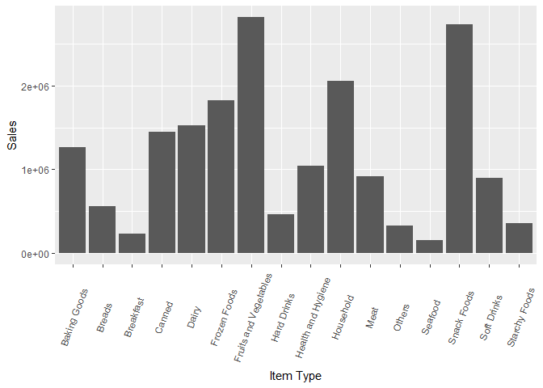
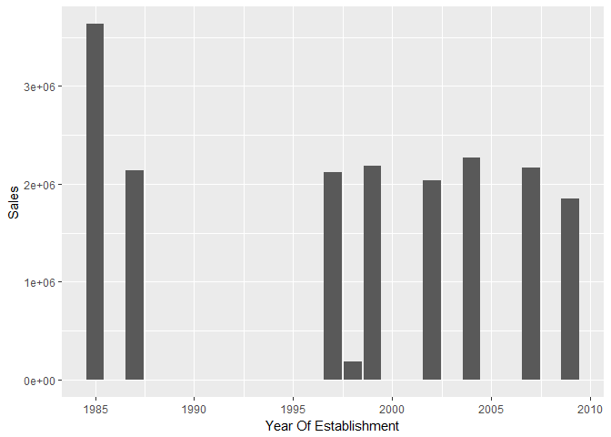
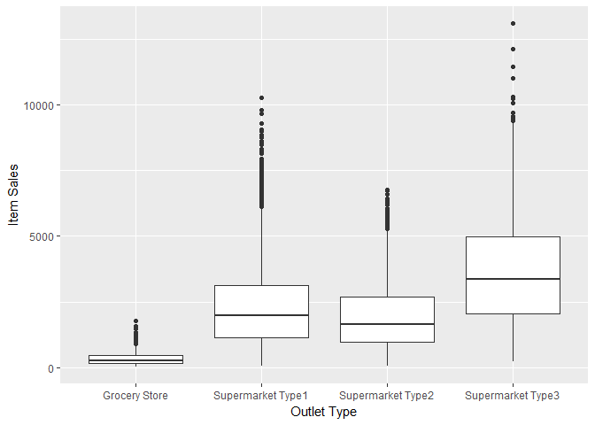
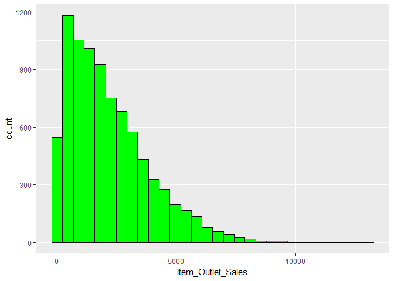
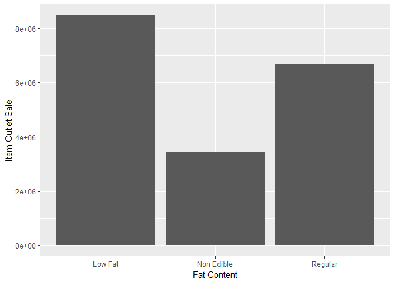

Big Mart Sales
================
Nihit R. Save
20th January 2017

Dataset: <https://datahack.analyticsvidhya.com/contest/practice-problem-big-mart-sales-iii/>

Data Exploration
================

Loading Data from work directory.

``` r
train <- read.csv("Train.csv")
test <- read.csv("Test.csv")
```

Checking variables and their data types in training set.

``` r
str(train)
```

    ## 'data.frame':    8523 obs. of  12 variables:
    ##  $ Item_Identifier          : Factor w/ 1559 levels "DRA12","DRA24",..: 157 9 663 1122 1298 759 697 739 441 991 ...
    ##  $ Item_Weight              : num  9.3 5.92 17.5 19.2 8.93 ...
    ##  $ Item_Fat_Content         : Factor w/ 5 levels "LF","low fat",..: 3 5 3 5 3 5 5 3 5 5 ...
    ##  $ Item_Visibility          : num  0.016 0.0193 0.0168 0 0 ...
    ##  $ Item_Type                : Factor w/ 16 levels "Baking Goods",..: 5 15 11 7 10 1 14 14 6 6 ...
    ##  $ Item_MRP                 : num  249.8 48.3 141.6 182.1 53.9 ...
    ##  $ Outlet_Identifier        : Factor w/ 10 levels "OUT010","OUT013",..: 10 4 10 1 2 4 2 6 8 3 ...
    ##  $ Outlet_Establishment_Year: int  1999 2009 1999 1998 1987 2009 1987 1985 2002 2007 ...
    ##  $ Outlet_Size              : Factor w/ 4 levels "","High","Medium",..: 3 3 3 1 2 3 2 3 1 1 ...
    ##  $ Outlet_Location_Type     : Factor w/ 3 levels "Tier 1","Tier 2",..: 1 3 1 3 3 3 3 3 2 2 ...
    ##  $ Outlet_Type              : Factor w/ 4 levels "Grocery Store",..: 2 3 2 1 2 3 2 4 2 2 ...
    ##  $ Item_Outlet_Sales        : num  3735 443 2097 732 995 ...

Checking for missing values

``` r
table(is.na(train))
```

    ## 
    ##  FALSE   TRUE 
    ## 100813   1463

There are 1463 missing values in the train data set. Lets see which variables have missing values.

``` r
colSums(is.na(train))
```

    ##           Item_Identifier               Item_Weight 
    ##                         0                      1463 
    ##          Item_Fat_Content           Item_Visibility 
    ##                         0                         0 
    ##                 Item_Type                  Item_MRP 
    ##                         0                         0 
    ##         Outlet_Identifier Outlet_Establishment_Year 
    ##                         0                         0 
    ##               Outlet_Size      Outlet_Location_Type 
    ##                         0                         0 
    ##               Outlet_Type         Item_Outlet_Sales 
    ##                         0                         0

Observing the distribution of variables in dataset.

``` r
summary(train)
```

    ##  Item_Identifier  Item_Weight     Item_Fat_Content Item_Visibility  
    ##  FDG33  :  10    Min.   : 4.555   LF     : 316     Min.   :0.00000  
    ##  FDW13  :  10    1st Qu.: 8.774   low fat: 112     1st Qu.:0.02699  
    ##  DRE49  :   9    Median :12.600   Low Fat:5089     Median :0.05393  
    ##  DRN47  :   9    Mean   :12.858   reg    : 117     Mean   :0.06613  
    ##  FDD38  :   9    3rd Qu.:16.850   Regular:2889     3rd Qu.:0.09459  
    ##  FDF52  :   9    Max.   :21.350                    Max.   :0.32839  
    ##  (Other):8467    NA's   :1463                                       
    ##                  Item_Type       Item_MRP      Outlet_Identifier
    ##  Fruits and Vegetables:1232   Min.   : 31.29   OUT027 : 935     
    ##  Snack Foods          :1200   1st Qu.: 93.83   OUT013 : 932     
    ##  Household            : 910   Median :143.01   OUT035 : 930     
    ##  Frozen Foods         : 856   Mean   :140.99   OUT046 : 930     
    ##  Dairy                : 682   3rd Qu.:185.64   OUT049 : 930     
    ##  Canned               : 649   Max.   :266.89   OUT045 : 929     
    ##  (Other)              :2994                    (Other):2937     
    ##  Outlet_Establishment_Year Outlet_Size   Outlet_Location_Type
    ##  Min.   :1985                    :2410   Tier 1:2388         
    ##  1st Qu.:1987              High  : 932   Tier 2:2785         
    ##  Median :1999              Medium:2793   Tier 3:3350         
    ##  Mean   :1998              Small :2388                       
    ##  3rd Qu.:2004                                                
    ##  Max.   :2009                                                
    ##                                                              
    ##             Outlet_Type   Item_Outlet_Sales 
    ##  Grocery Store    :1083   Min.   :   33.29  
    ##  Supermarket Type1:5577   1st Qu.:  834.25  
    ##  Supermarket Type2: 928   Median : 1794.33  
    ##  Supermarket Type3: 935   Mean   : 2181.29  
    ##                           3rd Qu.: 3101.30  
    ##                           Max.   :13086.97  
    ## 

Important Observations: The Item fat content variables seems to have mismatched levels. Also Outlet Size has a level with no value.

``` r
dim(train)
```

    ## [1] 8523   12

``` r
dim(test)
```

    ## [1] 5681   11

Test dataset has 1 less column which is that of value to predicted.

Adding Item Outlet Sales column in test dataset.

``` r
test$Item_Outlet_Sales <- NA
```

Data Exploration using Graphs
=============================

``` r
library(ggplot2)

 ggplot(data = train,aes(x = Outlet_Identifier,y = Item_Outlet_Sales)) + geom_boxplot() +scale_y_continuous(breaks = seq(0,15000,2000)) + theme(axis.text.x = element_text(angle = 70,vjust = 0.5)) +xlab("Outlet Identifier") + ylab("Sale of Item in Outlet") +ggtitle("Item sales according to Outlets")
```

https://github.com/kneehit/Big_Mart_Sales/blob/master/4a51132236a11f09

Conclusion: As can be seen from above box plot, Outlet 27 contributes to most sales while Outlet 10 and Outlet 19 contribute the least.

``` r
ggplot(data = train,aes(x = Item_Type,y = Item_Outlet_Sales)) + geom_bar(stat = "identity") + theme(axis.text.x = element_text(angle = 70,vjust = 0.5)) +xlab("Item Type") +ylab("Sales")
```



Conclusion: Fruits,Vegetables and Snacks are sold most in these outlets while sale of seafood and breakfast items is very less

``` r
ggplot(data = train,aes(x = Outlet_Establishment_Year,y = Item_Outlet_Sales)) + geom_histogram(stat = "identity")  + xlab("Year Of Establishment") + ylab("Sales") 
```



On the first glance it seems that the sales of outlet established in 1985 has most sales. But on closer observation we can notice that there are only 9 bars and we have 10 distinct outlets. This must mean two outlets launched in same year. Let us see which are those outlets.

``` r
library(plyr)
library(dplyr)
train %>% group_by(Outlet_Identifier,Outlet_Establishment_Year) %>% summarise(TotalSales = sum(Item_Outlet_Sales)) %>% arrange(Outlet_Establishment_Year)
```

    ## Source: local data frame [10 x 3]
    ## Groups: Outlet_Identifier [10]
    ## 
    ##    Outlet_Identifier Outlet_Establishment_Year TotalSales
    ##               <fctr>                     <int>      <dbl>
    ## 1             OUT019                      1985   179694.1
    ## 2             OUT027                      1985  3453926.1
    ## 3             OUT013                      1987  2142663.6
    ## 4             OUT046                      1997  2118395.2
    ## 5             OUT010                      1998   188340.2
    ## 6             OUT049                      1999  2183969.8
    ## 7             OUT045                      2002  2036725.5
    ## 8             OUT035                      2004  2268122.9
    ## 9             OUT017                      2007  2167465.3
    ## 10            OUT018                      2009  1851822.8

As it can be seen from above table, Outlet 19 and Outlet 27 were both established in 1985. Despite this,the sales of Outlet 27 is the most. On the other hand outlet 19 which also launched in 1985 has least sales.

Conclusion: Year of establishment does not have significant impact on sales

``` r
 ggplot(train,aes(x = Outlet_Type,y = Item_Outlet_Sales)) + geom_boxplot() + xlab("Outlet Type") + ylab("Item Sales")
```



We can conclude that customers tend to buy at supermarkets rather than at grocery store. This could be due to the fact that they can buy other items besides foods at supermarket.

Checking distribution of predictor variables

``` r
ggplot(train,aes(x = Item_Outlet_Sales)) + geom_histogram(colour = "Black",fill = "Green")
```



Our predictor variable is heavily skewed and would require transformation in later stages.

Data Manipulation
=================

Combining the datasets for manipulating data.

``` r
combined <- rbind(train,test)
str(combined)
```

    ## 'data.frame':    14204 obs. of  12 variables:
    ##  $ Item_Identifier          : Factor w/ 1559 levels "DRA12","DRA24",..: 157 9 663 1122 1298 759 697 739 441 991 ...
    ##  $ Item_Weight              : num  9.3 5.92 17.5 19.2 8.93 ...
    ##  $ Item_Fat_Content         : Factor w/ 5 levels "LF","low fat",..: 3 5 3 5 3 5 5 3 5 5 ...
    ##  $ Item_Visibility          : num  0.016 0.0193 0.0168 0 0 ...
    ##  $ Item_Type                : Factor w/ 16 levels "Baking Goods",..: 5 15 11 7 10 1 14 14 6 6 ...
    ##  $ Item_MRP                 : num  249.8 48.3 141.6 182.1 53.9 ...
    ##  $ Outlet_Identifier        : Factor w/ 10 levels "OUT010","OUT013",..: 10 4 10 1 2 4 2 6 8 3 ...
    ##  $ Outlet_Establishment_Year: int  1999 2009 1999 1998 1987 2009 1987 1985 2002 2007 ...
    ##  $ Outlet_Size              : Factor w/ 4 levels "","High","Medium",..: 3 3 3 1 2 3 2 3 1 1 ...
    ##  $ Outlet_Location_Type     : Factor w/ 3 levels "Tier 1","Tier 2",..: 1 3 1 3 3 3 3 3 2 2 ...
    ##  $ Outlet_Type              : Factor w/ 4 levels "Grocery Store",..: 2 3 2 1 2 3 2 4 2 2 ...
    ##  $ Item_Outlet_Sales        : num  3735 443 2097 732 995 ...

### Imputation of missing values in Item Weight

As we noted earlier there were 1463 missing values in Item Weight. On inspecting the dataset we can clearly see that items with same item identifier have equal weights. That makes sense as same items even though sold in different outlet would have equal weights. Lets impute the missing values in Item Weight.

``` r
combined <- ddply(combined,~Item_Identifier,transform,Item_Weight = ifelse(is.na(Item_Weight), median(Item_Weight,na.rm = TRUE),Item_Weight))

table(is.na(combined$Item_Weight))
```

    ## 
    ## FALSE 
    ## 14204

### Revalue of empty level in Outlet Size

Outlet size has a level which is empty. We categorize it as Other.

``` r
levels(combined$Outlet_Size)[1] <- "Other"
```

### Correction of mismatched levels in Fat Content

Fat content has similar levels for same fat content. We need to categorize them into Low Fat and Regular.

``` r
combined$Item_Fat_Content <- mapvalues(combined$Item_Fat_Content,from = c("LF","reg"),to = c("Low Fat","Regular"))
combined$Item_Fat_Content <- mapvalues(combined$Item_Fat_Content,from = c("low fat"),to = c("Low Fat"))
```

### Imputation of NAs Item Visibility

Item visibility is 0 for some of the items. If the item is present in an outlet it has to be visible. Therefore we will consider the items with 0 visbility to have missing values and replace them with median of item visibility of same item.

``` r
combined$Item_Visibility[combined$Item_Visibility == 0] <- NA

combined <- ddply(combined,~Item_Identifier,transform,Item_Visibility = 
                    ifelse(is.na(Item_Visibility),median(Item_Visibility,TRUE),Item_Visibility))
```

### Subdiving item into Item Category

On close observation of Item Identifier it seems all items begin with DR,FD or NC. Checking these items under Item Type the must mean Drinks,Food and Non Consumables respectively Lets make a new variable: Item Category

``` r
q <- substr(combined$Item_Identifier,1,2)
q <- gsub("DR","Drinks",q) 
q <- gsub("FD","Food",q)
q <- gsub("NC","Non Consumables",q)

combined$Item_Category <- q
combined$Item_Category <- factor(combined$Item_Category,levels = c("Drinks","Food","Non Consumables"))
```

### Addition of a level to Fat Content

As we categorized items into different categories,we noticed that some items were not consumables. Hence they should not have fat content either low or regular. Replacing fat content of non consumable items by Non Edible

``` r
combined$Item_Fat_Content <- as.character(combined$Item_Fat_Content)

combined$Item_Fat_Content <- ifelse(combined$Item_Category == "Non Consumables","Non Edible",combined$Item_Fat_Content)

combined$Item_Fat_Content <- as.factor(combined$Item_Fat_Content)
```

Lets see how fat content affects sales.

``` r
ggplot(data = combined,aes(x = Item_Fat_Content,y = Item_Outlet_Sales)) + geom_histogram(stat = "identity") + 
  
  xlab("Fat Content") + ylab("Item Outlet Sale")
```



Compared to regular fat content, Items with low fat content had higher sales. It seems that customers prefer low fat items.

### New Variable: Outlet Age

This data was collected in 2013 and therefore we can find how long the outlet has been running if we subtract establishment year from 2013

``` r
combined$Outlet_Age <- 2013 - combined$Outlet_Establishment_Year

combined <- select(combined,-c(Outlet_Establishment_Year))
```

### One Hot Encoding of Categorical Variabales

We will add separate columns for each level of categorical variable

``` r
library(dummies)
combined <- dummy.data.frame(combined,names = c("Item_Fat_Content","Item_Type","Outlet_Size","Outlet_Location_Type","Outlet_Type"))
```

### Splitting the dataset

``` r
new_train <- combined[!is.na(combined$Item_Outlet_Sales),]
new_test <- combined[is.na(combined$Item_Outlet_Sales),]
```

Using Linear Regression Model
=============================

``` r
lm1 <- lm(Item_Outlet_Sales ~ .,data = new_train)
summary(lm1)$adj.r.squared
```

    ## [1] 0.5628461

We get R^2 of 0.5628. This mean only 56% of variations can be explained by the data.

### Linear Model of log transformed data

One assumption of Linear Regression is that predictor variable is normalized. But our predictor variable Item Outlet Sales is heavily skewed to one side. Therefore we shall use log transform of sales in formula for linear regression.

``` r
lm2 <- lm(log(Item_Outlet_Sales) ~ .,data = new_train)
summary(lm2)$adj.r.squared
```

    ## [1] 0.7466735

Thus we can see that our model has greatly improved and about 75% of variations in data can be explained.

### Predicting the sales for test dataset

Now we can use our model to predict values of sales for test dataset.

``` r
prediction <- predict(lm2, newdata = new_test)

sub_file <- data.frame(Item_Identifier = test$Item_Identifier, Outlet_Identifier = test$Outlet_Identifier,       
                       Item_Outlet_Sales = exp(prediction))

write.csv(sub_file, "Predicted_Test.csv")
```
